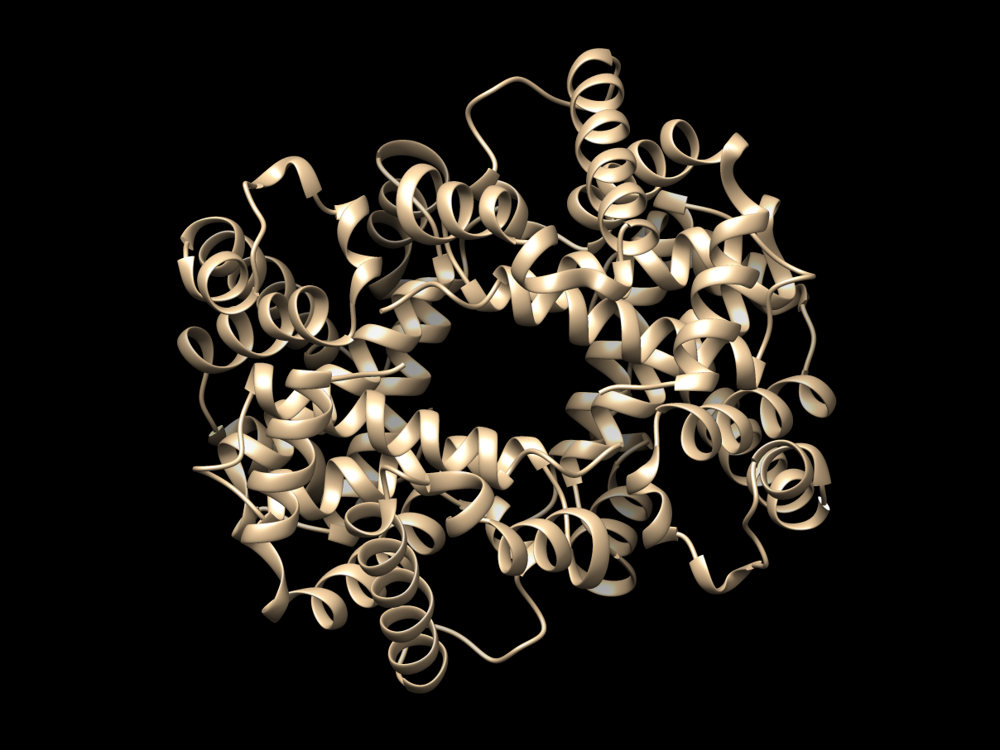
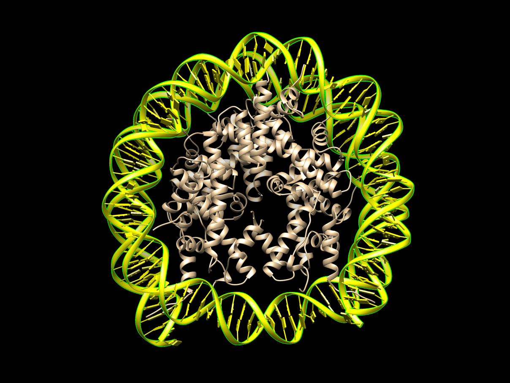
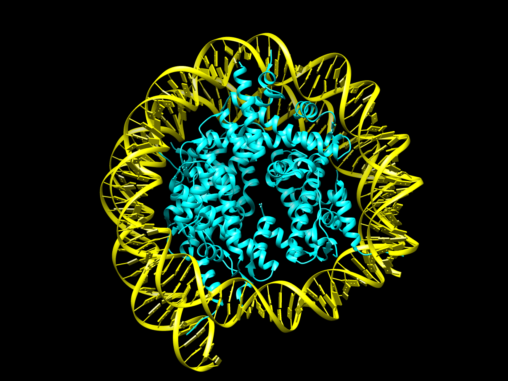
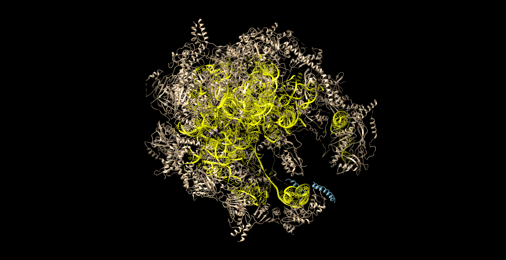
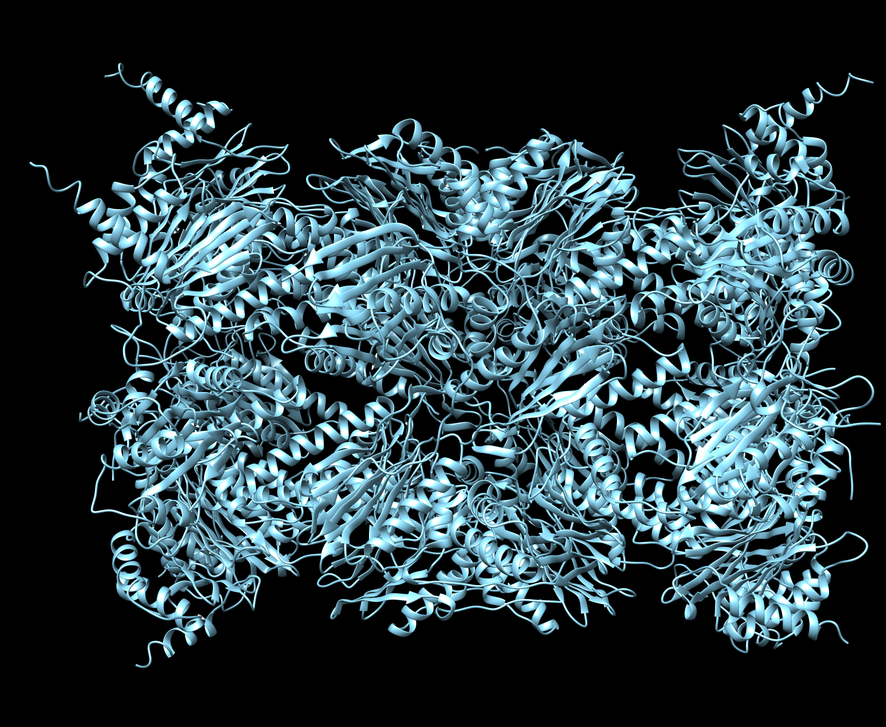
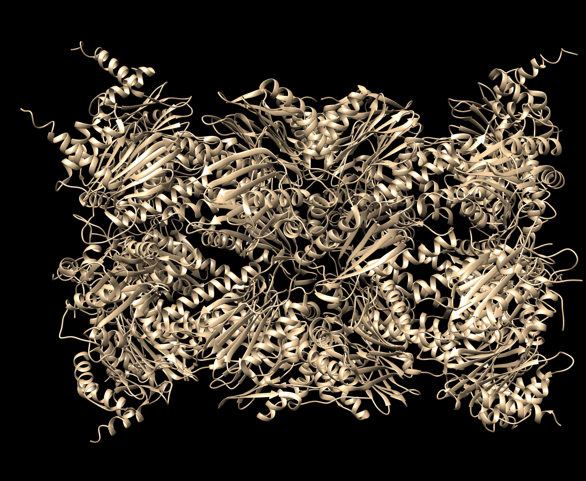
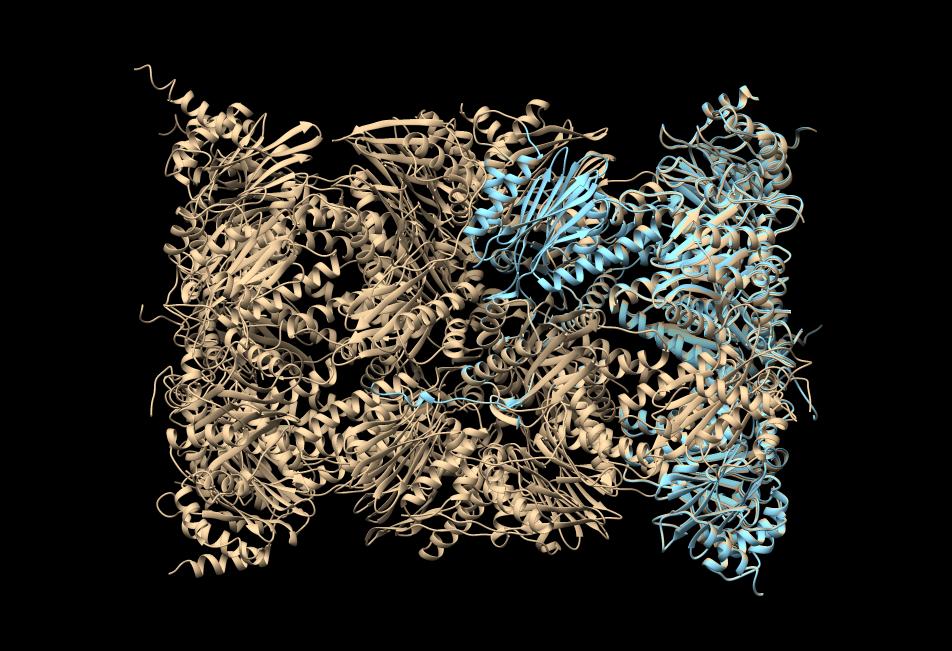
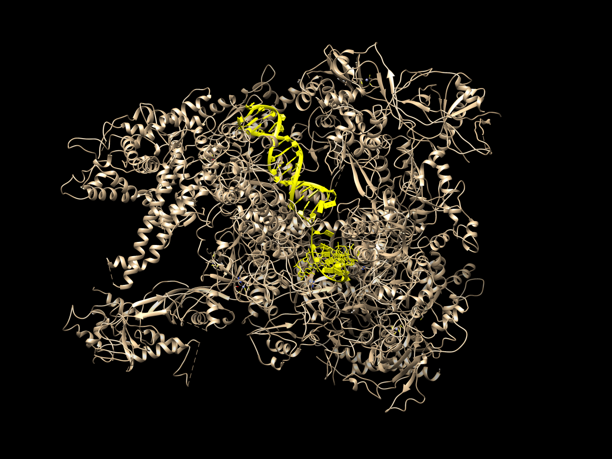
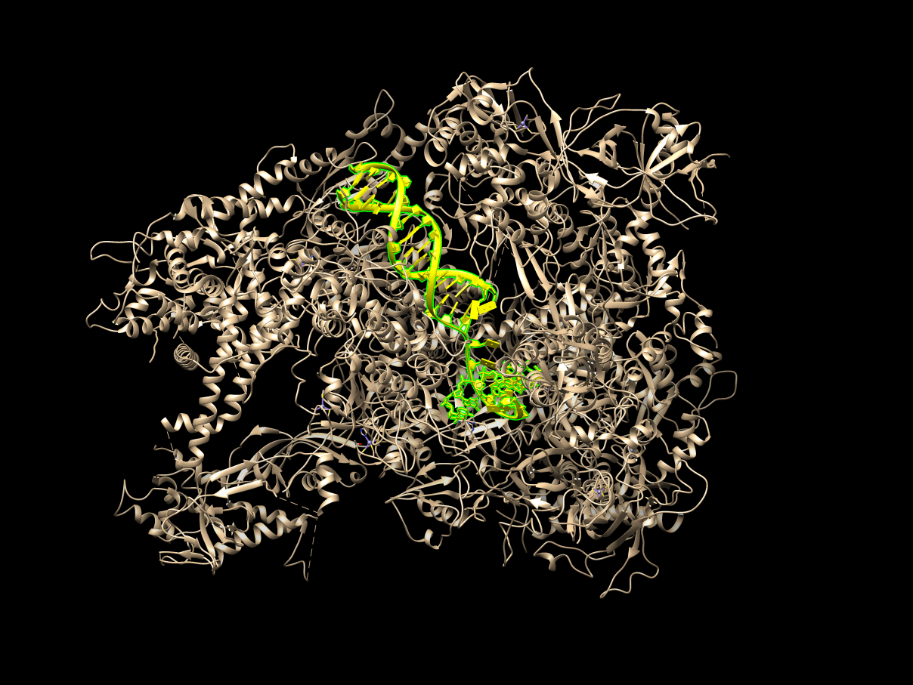
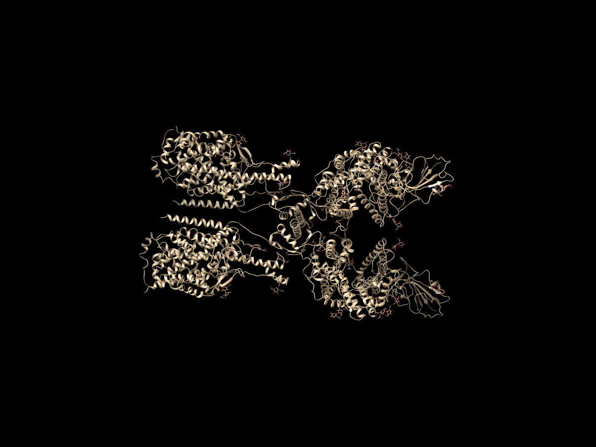

<p align="center"></p>


> A program to reconstruct biological macrocomplexes superimposing paired interacting elements

> protein - protein or protein - DNA/RNA

> Optimization of the model using MODELLER

> The results are stored in a PDB file with a _mylog.log file. 

<h2 align="center"> Abstract </h2>

In this project, through bioinformatic resources, we have developed a python based program capable of reconstruct biological macro-complexes of protein-protein and protein-DNA/RNA interactions using pairs of domains or chains interactions. Also, the target complex can be set to have a specific number of chains. The program is based on several bioinformatic features, including structural superimposition, energy optimization and sequence alignment. It gives a structure pdb file with the superimposed structures as a output. The main dependencies of the software are BioPython, NumPy and Modeller packages. This program can be downloaded from [GitHub](https://github.com/ferranpgp/McComplex).

## Table of Content
- [What McComplex is?](#What-McComplex-is?)
- [Biological Background](#Biological-Background)
    - [Protein-Protein Interaction and Complexes](#Protein-Protein-Interaction-and-Complexes)
       - [Structural superimposition](#Structural superimposition)
- [McComplex method](#McComplex-method) 
    - [Superimposition of the 3D structure](#Superimposition-of-the-3D-structure)
    - [Checking number of clashes](#Checking-number-of-clashes)
    -  [Optimization](#Optimization)
- [Algorithm](#Algorithm)
    - [Features](#Features)
    - [Future approaches](#Future-approaches)
- [Tutorial](##Tutorial)
    - [Dependencies Installation](#Dependencies-Installation)
    - [Clone repository](#Clone-repository)
    - [Command line arguments](#Command-line-arguments)
        - [Mandatory arguments](#Mandatory-arguments)
        - [Optional arguments](#Optional-arguments)
    - [Analysis examples](#Analysis-examples)
    - [Performance](#Performance)
        - [Structure of the program](#Structure-of-the-program)


- [Limitations](#limitations)

- [Team](#team)

- [Bibliography](#Bibliography)

  <div style="page-break-after: always; visibility: hidden"> </div>


# What McComplex is?

McComplex is a Python program whose goal is to model macrocomplexes molecules from pairs of domains or chains of a structure that will form the complex. It can be build complex from proteins chains, DNA and RNA strands. It also allow us to set some parameters to adjust the final complex according to the users needs.
In essence, the builder approach is the superimpositions of structures between subunit chains from different PDB files given as input. The builder places pair by pair all the possible chains into a single model.


# Biological Background

Proteins are the executive molecules in all organisms.They interact and form polypeptides complexes in order to perform their function. These interactions are done by the combination of distinct electrostatic forces such as hydrogen bonds, hydrophobic effect, disulphide bonds. Therefore, structure of a protein can reveal not only its function but also its evolutionary history. Nowadays, we use different techniques to visualise and model protein complexes such as NMR or X-ray crystallisation, and bioinformatics tools, which are very good at evaluating and refining the complexes.

## Protein-Protein Interaction and Complexes

Understanding the Protein-Protein Interaction (PPI) and Complexes are crucial points to understand the function of the program. Quaternary protein structure can have more than one separated chains of proteins and they interact between them. These interaction are done by intermolecular bounds, such as hydrogen bounds, electrostatic interactions, pi stacking, cation-pi interaction, and more. These interactions stabilise the molecules and make the protein-protein interaction have a biological function.

This information gives us more evidence that proteins are no individual entities but they work in complex with other to have one one or more functions. These complexes can be by PPI or protein-nucleotides (DNA or RNA) interactions. Some examples are the nucleosome, the spliceosome, the proteasome and the ribosome. In other words, the reason that collecting PPIs can lead to a better understanding of protein functions, biological pathways and mechanisms of disease, the interest of modern structural genomics has changed to the study of macromolecular complexes. However, using just conventional methods is very hard and  expensive in terms of time, money, and expertise to do the assembly and the study of these macromolecular due to their large size and structural flexibility.(Biophys. J., 89, 2005) Since computational tools have been designed to store the in silico modeled 3D structures of proteins, many structures of individual subunits and/or interactions can be built in order to predict the complete macromolecular structure(Gupta et al., 2014). In general, all computational approaches to PPI prediction attempt to leverage knowledge of experimentally-determined previously known interactions, in order to predict new PPIs. (Pitre et al., 2008). Many advances have been achieved in this field, however the range of successful organisms is short and general frameworks are lacking at the moment.

There are three main categories of methods for computational modelling of PPIs. These are the template-base modeling, which is base on evolutionary information of the sequence and the structure in order to do the PPI prediction. The integrative modelling mixes experimental data techniques with bioinformatics tolls to reduce the candidate complexes. Lastly _ab initio_ or template-free modelling which explores all the possible orientation between the interacting molecules, this method requires a lot of computations resources.


## Structural superimposition

Structural superimposition is commonly used to compare multiple conformation of the same protein and to evaluate the quality of the alignments produced. This technique consists of setting the atoms of a new chain on top of the set of atoms of another chain minimizing the distances between the backbone atoms of both structures. These chains can be two proteins, two DNA/RNA molecules, etc. The difference with sequences alignment is that this last one considers that residues are those that fill the same position in the alignment according to a sequence similarity criteria. However, structural alignment considers that only the closest residues in the space are equivalent.


# McComplex method

The approach of our program is the superimpositions of structures between subunit chains using the module Superimposer from Bio.PDB.The algorithm can be divided in three steps. The first step is the performance of the superimposition of the binary protein structures. The second one is, energy levels in the models are taken into account to discard unlikely complexes. Lastly, it could do the the optimisation of the energy of the models if it is desired.


#### Superimposition of the 3D structure
To build the model, the program is given a list of PDB files, each of them containing information about two interacting chains, whether peptidic, DNA or RNA. Before to make the protein superposition we have to recognise that two sequences are the same type of molecule and put them together in the correct spot. To do so, we can overlap similar proteins chains from two different files to see whether o not two chains are alike in order to join them in the same model.

We could find that two proteins with lower identity score may have similar structures in a 3D space, as a result of convergent evolution. Therefore, we bear in mind that in our model when two proteins have similar structure but big differences in the sequence the may have the same role.

In these cases, to test if two proteins really have similar structures, translation and rotation matrices are measured in order to performs this. To do so, the query structure chain is superposed to the Cα coordinate of a reference chain .Similar structures will have atoms in almost the same positions, while different structures will be more distant. This similarity between the superimposed proteins can be used to calculate the Root-Mean-Square Deviation (RMDS). The RMDS is a quantitative measure that be calculated for any type and set of atoms, usually Cα are the most commons ones, of the superimposed molecules. The values are presented as Å and calculated by:


Where *n* is the number of atom pairs that will be compared, *v* and *w* are the molecules that will be compared,  *i* is the number of the the residue, (*v<sub>i<sub>x</sub></sub>*, *v<sub>i<sub>y</sub></sub>*, *v<sub>i<sub>z</sub></sub>*) is the coordinate of one atom of *v* and (*w<sub>i<sub>x</sub></sub>*, *w<sub>i<sub>y</sub></sub>*, *w<sub>i<sub>z</sub></sub>*) are the coordinates from one atom of *w* superposed with *v* using a linear application of rotation and translation. To compute the RMSD between molecules *v* and *w*, we will use the coordinates of the backbone atoms of residues as close as possible in space after superposition.

A value close to zero and below to 3 indicates a perfect fit of the structures. RMSD will increase when the differences between the protein structures increase.

The main disadvantage of the RMSD lies in the fact that it is dominated by the amplitudes of errors. Two structures that are identical with the exception of a position of a single loop or a flexible terminus typically have a large global backbone RMSD and cannot be effectively superimposed by any algorithm that optimises the global RMSD.(Kufareva. I. et al. 2015). However it is easy and fast way to analyse the similarity of two structures.


#### Checking number of clashes

After the superimposition and even thought we get a acceptable RMSD, our method is subjected to superimposition error. As the program is trying to build a multi-chain complex, it will analyse the chain of the sample structure that has not been superimposed. The atom coordinates of this non-superimposed chain has changed, they have rotated towards the reference structure due to the superimposition process. To be sure that this new rotation is correct, we have to check whether or not collisions or clashes appear when they were joined in the structure. It is crucial to take this into account, firstly because clashes are unfavourable interactions when atoms are too close. Also it will avoid impossible models that will be thermodynamically unstable and unlikely to happen, such as those with chains crossing with each other.
To perform the calculation of clashes we use a K-dimensional tree data structure (KDTree). It uses N-dimensional vectors to find all points within a radius of a given point. Thus, we can know how many atoms have at least one atom within radius of centre. In a real proteins, clashes cannot happen, because if the distance between two atoms is minimum, the energy is maximum. For instance, repulsive forces prevail in Van Der Waals interactions, due to the collision of external electron clouds, making this interaction unfavourable. If the number of clashes is below a given threshold, we can allow this new rotation and add the chain in the reference structure.


#### Optimization

Once the model is generated, in order to validate it, we can do the optimization of the structure with conjugate retraints.That is done by spatial restraints stequimetry (bond, angle, dihedral, torsiom and improper) and molecular dynamics in a 300K during an cetains number of iteration. The stats are written every 5 iteration in a log file.


##### Stereochemical restraints :

* 'BOND'. This calculates covalent bond restraints (harmonic terms). It relies on the list of the atom-atom bonds for MODEL, prepared previously by the model.generate_topology() command. The mean values and force constants are obtained from the parameter library in memory. Only those bonds are restrained that have all or at least restraint_sel_atoms in the selection atmsel.
* 'ANGLE'. This calculates covalent angle restraints (harmonic terms). It relies on the list of the atom-atom-atom bonds for MODEL, prepared previously by the model.generate_topology() command. The mean values and force constants are obtained from the parameter library in memory. Only those angles are restrained that have all or at least restraint_sel_atoms in the selection atmsel.
* 'DIHEDRAL'. This calculates covalent dihedral angle restraints (cosine terms). It relies on the list of the atom-atom-atom-atom dihedral angles for MODEL, prepared previously by the model.generate_topology() command. The minima, phases, and force constants are obtained from the parameter library in memory. Only those dihedral angles are restrained that have all or at least restraint_sel_atoms in the selection atmsel.
* 'IMPROPER'. This calculates improper dihedral angle restraints (harmonic terms). The mean values and force constants are obtained from the parameter library in memory. Only those impropers are restrained that have all or at least restraint_sel_atoms in the selection atmsel.
* 'STEREO'. This implies all 'BOND', 'ANGLE', 'DIHEDRAL', and 'IMPROPER' restraints.


# Algorithm

The program McComplex makes possible the construction of biological macro-complexes of protein-RNA / DNA interactions and protein-protein interactions. Here we are going to provide a complete explanation of how McComplex algorithm works

The input to be passed to the program consists of a necessary argument: -i, which is the input directory that contains all of the binary interaction PDB files and these PDB files will be used to build the complex. In addition, there are some arguments that change the operation of the program according to the user needs by changing some parameters that the program will run. These are `-rmsd`, `-cl`, `-nc` and `-opt`, these have a certain values as default such a 0.3, 30 and 100 respectively. For instance, if the user believes that this complex should have more than 100 chains that should make changes in this parameter. Apart from these, it has the -pi and `-v` flags. When the `-pi` flag is present, it allows the program to save a PDB / MMCIF file each time the user adds a chain to the complex. The `-v` flag allows printing of the log progress at the command line.

In order to be able to build a large complexes, a recursive approach is needed. In the first level of recursion, it creates a recursive loop in the list of binary-interaction PDB files contained in the input directory where it chooses a pairwise interaction. It tries to add all the pairs containing one of these two initial molecules in common in order to build a complex. In the following level of recursion, the complex model has grown and the addition of more subunits is tried with the model at that point, and so on and so forth. Therefore, it stars from a file of a pairwise interaction, the McComplex recursive function is called, which through the dictionary superimposition function performs the previously explained superimposition, rotation and addition in a recursive way.

When the chain number of the complex reaches the number specified in the `-nc` argument (ie equals), or if the chain count is not equal after files have been processed once without adding new chains to the complex, it will finish running.

There are required certain parameters in order to run the program when the function is called and they are the following respectively:

ref_structure: it's a reference structure, as it is the first PDB file in the first iteration, it also allows the number of chains to increase as iterations are repeated.
files_list: This list contains all of the input files.
it: It's an integer to follow the iteration of recursive currently in.
not_added: It's an integer that saves the files that may have been processed or files with no chains added after processing.

ArgumentParser, which contains all arguments that are necessary for the program to work or depends on the user's request. `command_arguments `are the following:

* _indir_: input directory.
* _outdir_: output directory.
* _nc_: It indicates the number of chains that the final complex should have.
* _verbose_: progression log printed in a standard output file 
* _pdb_iterations_: each time a chain in added into the complex, a new PDB file will be saved.
* _RMSD_threshold_: This argument allows us to have a limit for superimpositions to be taken as correct. In addition, it will be constant and it means that RMSD will not change during the running time.
* _clashes threshold_: Indicates the maximum number of collision the chains must have with a reference structure. It will not change during a running time like the RMSD thresholds.
* _optimization_: the user can choose if he/she wants to run an optimisation on output structure

The file will be processed in each iteration. In the first step, a structure instance will be created from the file and then the function  `dict_superimposition` will be called by a reference, a query structure and RMSD threshold as parameters. This function handles the two chains in the query structure and all chains from the reference to make all possible superimpositions. On the other hand, only if the number of C4’, for nucleic acids or atoms and the number of CA for proteins are getting by `Key_atom_retriever` function that should be the same in both chains. In the case that  they are the same kind of molecule such as RNA, DNA, it returns a sorted list of keys that according to the RMSD value. It will returns a dictionary with a tuple of reference and query identifiers chains as key and the Superimposer instance of these two chains, a boolear parameter that indicates whether or not there is superimposition, the best RMSD score in this interation and the the counter of iteration updated.

There are some cases where the boolean is False such as; if there is no common chain between sample structure and reference, or if the smallest RMSD is higher than threshold. In such cases, the current processed file is removed and added to the end of the list, thus, the future iterations will be processed and 1 will be added to the iteration, the function will be called again with files that do not add any chain counters.

In any case, if the RMSD value of the specified reference chain < threshold and if there is a common chain, loops move through the ordered list of key-value tuples with Superimposer objects as value. If its RMSD > threshold, this loop will continue, and is going to the next entry of the ordered list of tuples.
However, if RMSD < threshold, we take the superimposer instance, rotation and translation matrices are applied to key atoms of the putative chains that are not common with the reference structure, CA for proteins, or C4 for nucleic acids. with new coordinates, in cases where the user wants to add atoms, the existence of conflicts between the new coordinates of the putative chain and the reference structure is controlled by the program.

The number of conflicts must be below the threshold for it to continue checking other reference chains. If none of the currently existing (putative) chains and set of reference chains to be added has more clashes than the threshold, this program indicates that the current chain to be added does not exist in the complex and also does not clash with any of the other chains that exist, so it is right to add. The task of the ID_creator function is to generate a unique ID for this chain that will not have any of the chains that currently exist in the complex. If the chain is correctly appended to the reference structure, according to the value of the `--pdb_iterations` argument, the program may create a PDB / MMCIF file that will contain the complex structure so far, as usual, the file is popped and added at the end of the list, on the other hand, any of the files that have not been added chains become 0, while the iterations counter increases by 1 and recursive function is called again by the program.
Conversely, If a combination exceeds the clashes threshold, the addition of that rotated chain is canceled because it cannot be added to the complex, which means that it is already in the complex or clashing with a chain.When this happens, a boolean is created that takes the value True. This shows that the chain already exists in the complex. After the loop of reference chains is broken, the next superimposition in the tuple list will be observed. If any of the superimpositions yields does not provide a chain to add, the loop comes to the end, and then the current file is added to the end of the list after it is opened, the iterations and files that can not add a new chain to complex counters were programmed to increment by one and the function calls itself again.
This function will stop running when the user has reached the number of chains requested or as we mentioned above, files are processed once without adding a new chain to the complex (no chains can be added). With this algorithm, the user does not have to specify the number of chains even if the complex structure does not know how many chains it has, at the same time the program will create the target complex and all files will be processed once without any chains added, and then the program will stop running.

## Features
The most distinct features of McComplex are:
1. Building of macromolecular complexes from just simple  binary interaction PDB files as input. 
2. Optimization of the final model using MODELLER.

## Future approaches
We have mention above that there are several ways for modelling PPIs. Our knowledge from now is very limited in order to develop a refined algorithms. However, we would have liked to improve the project in order to  improve the user experience and the accessibility to existing data.
It would be interesting to offer different options of modelling. Depending on the user need it could choose a template-based or a template-free approach.
Also it would be very useful to have an automatic download of structures from public databases, such as Uniprot or PDB. The structure and the sequences would be obtained by Biopython modules and some keyword and ID search.These would be use automatically as input data in a script that would build the pair of interacting molecules in order to run McComplex.
Finally, we thought about making a .cmd file in order to executed ProSa 2003. In this way we would get a file with the z-score table and we would have been able to check if the structure was energetically valid.


# Tutorial
In this part, you can find how to use the McComplex with a comment line argument when running the program, which arguments (mandatory or optional) are used, as well as a few examples in detail.
In order to make McComplex work you need some dependencies that must be installed beforehand to run the program. These are Python3 and Biopython.

## Dependencies Installation

- **Python 3.0**:
  - Window OS and iOS: `https://www.python.org/downloads/release/python-394/`
  - Linux is likeyly it is already installed
- **Python modules**
	- BioPython:
		```
		$ pip install biopython
		```
	- Modeller: 
			Following the installation tutorial from [this website](https://salilab.org/modeller/download_installation.html) depending on the OS of your computer.
	- NumPy
	- re
	- argparse

## Clone repository

- You can clone the repo to your local machine

```
$ git clone https://github.com/ferranpgp/McComplex

```

## Command line arguments

You can introduce the different arguments via command-line:

### Mandatory arguments

* '-i', '--indir':  path to the folder containing the binary interaction PDB files that the user will use when creating the macromolecular complex.

### Optional arguments

* '-nc', '--number_chains':  shows how many chains are requested by the user in the last complex model. Default value = 100
* '-o', '--outdir': all output files can be collected in this folder.
* '-v', '--verbose': show the detailed progression of the building process in a file called 'McComplex_mylog.log'. It will be stored in the _output directory.
* '-pi', '--pdb_iterations': saves a new PDB file each time the chain is added to the complex.
* '-rmsd', '--rmsd_threshold': the Root Mean Square Deviation threshold will take its value. Default value=0.3
* '-cl', '--clashes threshold': the clashes threshold will take its value. Default value = 30
* '-opt', '--optimisation': it runs an optimisation on your output structure and saves it in a separate PDB file. It is only available for structures with less than 99.999 residues. 

<!-- Chimera comparison with prediction etc  -->


## Analysis examples

As said before, to generate any macrocomplex structure it is required a directory with a list of PDB files with paired structures. All the data needed to execute the following examples is in the folder `examples`, remember that you have to download it as described in the [installation](#installation) section.  

- The output folder will be created in the same directory of the input folder if output director is not set it.In this case the out put will be found din the `examplex_output`folder. The output that will be place inside of the output folder will have 4 models called McComplex.MD0001.pdb, McComplex.MD0002.pdb, McComplex.MD0003.pdb, McComplex.MD0004.pdb, the optimized model (McComplex_optimized.pdb) and the original reference structure (McComplex.pdb) in order to compare with the models.  Also we will get a logging file were is store all the comments of the steps that the program has followed.

> Inside the folder `examples` there are all the examples we will describe in this tutorial in the corresponding directories: `1gzx`, `5fj8`, etc. Each of them contains the required files to run McComplex and also a pdb file of the reference structure, `exampleRef.pdb`, in order to check the superimposition between the constructed model and the real structure.

Here below, there is also an explanation of each complexes examples, some analysis about the time it takes the script to execute and the quality of the complex it builds.The examples we have choosed are: 1gzx, 3kuy, 4r3o, 5oom, 6m17

> It is not mandatory to set the number of chains of the final complex, however we have added it in the commands so it finishes earlier.

###  Example 1, 1GZX

This first example, it is the protein 1GZX which is a small complex composed by two different amino acid chains. Each one of the chain appears two times with a stoichiometry 2A2B, so the final structure has four chains. The following command will recover the complete complex.

Command line execution:


```shell
python3 McComplex_builder.py -i examples/1gzx -opt

```
 - `-i`, mandatory, it is followed by the directory of 1gzx folder containing all the binary-interaction PDB files


The resulting structure is stored in the current directory, `1gzx`, in the folder `1gzx_output`.


| **McComplex** | **Reference structure** | **Superimposition** |
| :---: | :---: | :---: |
|  |  |  |


In the superimposition image we can observe the reference structure in red and the structure obtained with Complex Constructor in blue. We observe that the colours are mixed in most of the chains as our model fits the reference downloaded from PDB quite well.

The computation time is around 26-27 seconds, and using Chimera we computed the RMSD between 146 pruned atom pairs and obtained a result of 0.000 angstroms.

### Examples 2, 3KUY

3KUY is a complex composed by a DNA coil and a core made of protein chains. There are four  different amino acid chains and one nucleotide chain, all of them have stoichiometry two, making a total of 10 chains. The procedure to run this example is the same as the explained before. The data to construct the complex is inside the folder `examples/3kuy`. Execution with command-line arguments:

```shell
python3 McComplex_builder.py -i examples/3kuy -opt

```

 - `-i`, mandatory, it is followed by the directory of 3kuy folder containing all the binary-interaction PDB files


The resulting structure is stored in the current directory, `3kuy`, in the folder `3kuy_output`.


| **McComplex** | **Reference structure** | **Superimposition** |
| :---: | :---: | :---: |
|  |  |  |

In the superimposition image we can observe the amino acid chains of the reference structure in red and the DNA chains in yellow. The colours of the structure obtained with Complex Constructor are blue and orange respectively.   
We observe that the whole complex is correctly constructed and after superimposing the obtained structure with the structure downloaded from PDB, we can see that both protein chains and DNA chains fit quite well with the reference structure.  

The computation time is around 65-66 seconds, and using Chimera we computed the RMSD between 106 pruned atom pairs and obtained a result of 0.000 angstroms.

### Example 3, 5OOM

This third example is the native assembly intermediate of the human mitochondrial ribosome with unfolded interfacial rRNA. It is a Hetero 53-mer with a stoichiometry: ABCDEFGHIJKLMNOPQRSTUVWXYZabcdefghijklmnopqrstuvwxyzA.  The data to construct the complex is inside the folder `examples/5oom`. Based on the input provided, the following command will recover the complete complex:

```shell
python3 McComplex_builder.py -i 5oom -opt

```
The input folder contains 125 files and 53 different chains. It is worth to put attention to this structure due to that it has also RNA molecules, we can show the adtantion of the program  reconstructing not only PPIs but also proteing-DNA or protein-RNA interactions. We can see that  two chains which share the same molecule type can be superimposed and  the program will avoid to do the superimpositions if it doesn't fit this criterial. Moreover, after 243 iterations the 53 chain were built.

| **McComplex** | **Reference structure** | **Superimposition** |
| :---: | :---: | :---: |
|  |  |  |

The computation time is around 1275  seconds and  using Chimera we computed the RMSD between 385 pruned atom pairs and obtained a result of 0.000 angstroms.

### Examples 4, 4R3O

This is a bigger complex is known as the Human 20S Proteasome (4R3O), it is only made of amino acid chains. It is a symmetric complex and it has 14 different chains. All the chains have a  stoichiometry  two, threfore the complex is build by  a total of 28 chains. 
The input data can be found in `examples/4r3o`. Execution with command-line arguments:

```shell
python3 McComplex_builder.py -i examples/4r3o -opt

```

 - `-i`, mandatory, it is followed by the directory of 4r3o folder containing all the binary-interaction PDB files

The resulting structure is stored in the current directory, `4r3o`, in the folder `4r3o_output`.

| **McComplex** | **Reference structure** | **Superimposition** |
| :----: | :----: | :----: |
|  |  |  |

The input folder has 86 files and 28 different chains and we can see that after 155 interations the total number of chains were built. 
The computation time is around 1621 seconds  seconds and  using Chimera we computed the RMSD between 250 pruned atom pairs and obtained a result of 0.000 angstroms.


### Example 5, 5FJ8

This complex is composed by nucleotides and amino acid sequences. It is not a symmetric complex. Also, it has 20 different chains and non of them are repeated which means that all are unique in the complex. The required inputs for the construction are in `examples/5fj8`.

```shell
python3 McComplex_builder.py -i examples/5fj8 -nc 20 -opt

```

The resulting structure is stored in the current directory, `5fj8`, in the folder called `5fj8_output`.

| **McComplex** | **Reference structure** | **Superimposition** |
| :---: | :---: | :---: |
|  |  |  |

The model that was created by McComplex and the reference structure are very well superimposed as in previous cases. In this case, the amino acid chain Q, have several amino acids labelled as 'unknown' in the pdb files. We have taken 35 amino acidos out from the pdb file called `5fj8_OQ` , therefore the chain Q will be partly contructed in the model. However as the complex is quite big and it takes a lot of time to build the entire complex, we set a number of chain equal to 20 the model did reach this chain. Nevertheless, the rest of the structure is correctly reproduced. `

The computation time is around 215 seconds and  using Chimera we computed the RMSD between 1422 pruned atom pairs and obtained a result of 0.000 angstroms.


### Example 6,  6M17

6m17 structure is a membrane protein of the SARS coronavirus. It has been released at PDB on march 2020. In the last year, it has been very useful to know the structure of this membrane protein and how it interacts with others proteins. Due to it help to find a vaccine or a drug to cure infected people or prevent to the most venerable ones. This complex It has three different amino acid chains and all of them have stoichiometry two, making a total of 6 chains.  The data is inside the folder `examples/6m17`. Execution with command-line arguments:

```shell
$ python3 McComplex_builder.py -i examples/6m17 -opt

```

The resulting structure is stored in the folder `6m17_ouput`, in the directory of the folder `6m17`.

| **McComplex** | **Reference structure** | **Superimposition** |
| :---: | :---: | :---: |
|  |  |  |

We can see that the whole complex was constructed correctly. The superimposition between the McComplex structure with the original structure from PDB shows that all the chains fit quite well with the reference structure.

The computation time is around 106 seconds and  using Chimera we computed the RMSD between 748 pruned atom pairs and obtained a result of 0.000 angstroms.


## Performance

To understand deeply how superimposition work we will put an examples. If we have have two binary protein interactions, reference: **1-2**, query:**3-4**. There will be four superimpositions between the query chains and the reference, **3-2**, **3-1**, **4-2**, **4-1**. Then, they will be ranked by RMSD. It starts processing the lowest RMSD (and below a given threshold) superimposition, for example the 3-2 superimposition, then  3-1 and so on so forth. If we assume that chains 1 and 3 are equal, and it seems to be correct when it gets the interaction with the non-superimposed chain called 4. Now, what it is needed is to check whether or not  there are collisions or clashes between the non-superimposed chain and the references structure chains 1 and 2. If a high number of clashes are found means that the assumed chain to add is in the complex or it is colliding with another chain. So, even though the superimposition has a an acceptable RMDS value, the precence of clashed make the program to  rejecte that model. Then it looks for next best RMSD score and check the number of clashes again in the new superimposition and it repeats the same until all chains are superimposed. Also, it check if the number of clashes is below the threshold. Therefore, the final structure will be **2-1-4**. We can keep following the same strategy with the next binary interaction. However, there will be more superimpositions and comparison to make than chains.


### Structure of the program

#### McComplex

- `McComplex_builder.py`: main module of Complex Constructor. It connects with all the rest of modules.

- `McComplex_functions.py`: module with all the functions needed to run the construction of macrocomplexes, as the `McComplex` function and `dictionary superimpositor`.

- `parse_logger.py`: reads and organises the command-line arguments.

- `optimization.py`: Modeller optimisation script.

- `sequence_data.py`: utilities data of DNA, RNA nucleotides names and the AA of protein.


## Limitations

- The main limitation of the program is the preparation of the input files. The PDB file must have each ID just once and the sequences must be unique, that means, if a structure has a stoichiometry 1A1B, the PDB file has to contain just once the chain A and B sequences.

- As we set that the identity of the sequences should be over 99%, the sequences in the PDB files should be almost identical in order to be identified as the same sequence. That means they must have the same number of residues and atoms.

- The amino acids labelled as 'unknown' in the pdb files and as 'X' in the FASTA sequences, cannot be correctly identified so they should not be present in the input files. As a consequence, those chains containing unknown amino acids are just partly constructed in the final model.

- It does not check the Z-score for the macrocomplexes with unknown structure through the energy analysis.


## Team
| <a href="https://github.com/ferranpgp" target="_blank">**Ferran Pegenaute**</a> | <a href="https://github.com/mluciarr" target="_blank">**Maria Lucia Romero**</a> | <a href="https://github.com/AktanIpek" target="_blank">**Ipek Aktan**</a> |


## Bibliography

Biophys. J. Global rigid body modeling of macromolecular complexes against small-angle scattering data. 89 (2005), pp. 1237-1250, 10.1529 biophysj.105.064154

Chang, J., Zhou, Y., Qamar, M. T. U., *et al.* Prediction of protein–protein interactions by evidence combining methods. *International Journal of Molecular Sciences* 17, 1946 (2016). doi: 10.3390/ijms17111946

Gupta, C. L., Akhtar, S., & Bajpai, P. (2014). In silico protein modeling: possibilities and limitations. EXCLI journal, 13, 513–515.)

Hayes, S., Malacrida, B. , Kiely, M., Kiely, P. A. Studying protein–protein interactions: progress, pitfalls and solutions. *Biochemical Society Transactions* 44, 994-1004. doi: 10.1042/BST20160092

Kufareva, I., & Abagyan, R. (2012). Methods of protein structure comparison. *Methods in molecular biology* (Clifton, N.J.), 857, 231–257. https://doi.org/10.1007/978-1-61779-588-6_10

Liu, S., Liu, C., Deng, L. Machine learning approaches for protein–protein interaction hot spot prediction: progress and comparative assessment. *Molecules* **23**, 2535 (2018). doi: 10.3390/molecules23102535

Nealon, J. O., Philomina, L. S., McGuffin, L. J. Predictive and experimental approaches for elucidating protein–protein interactions and quaternary structures. *International Journal of Molecular Sciences*, 2623 (2017). doi: 10.3390/ijms18122623

Keskin, O. , Tuncbag, N. , Gursoy, A. Predicting protein-protein interactions from the molecular to the proteome level. *Chemical Reviews* **116**, 4884-4909 (2016). doi: 10.1021/acs.chemrev.5b00683

```

```
